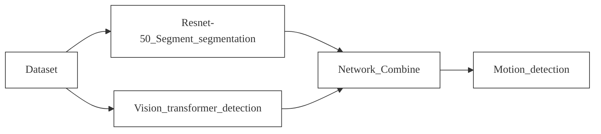

# Exminationroom_dection

## Structure

```mermaid
%%{
  init: {
		'theme': 'base', 'themeVariables': { 'primaryColor': '#ffffff', 'primaryBorderColor': '#333333', 'lineColor': '#333333', 'fontSize': '16px', 'fontFamily': 'Times New Roman'}

  }
}%%
graph LR
    A[Dataset] --> B[Resnet-50_Segment_segmentation]
    A --> C[Vision_transformer_detection]
    B --> D[Network_Combine]
    C --> D
    D --> E[Motion_detection]
```
