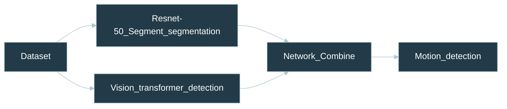

# Exminationroom_dection

## Structure

```mermaid
%%{
  init: {
		"theme": "base",
    "themeVariables": {
      "darkMode": "true", 
      "background":"#202020",
      "primaryColor": "#233B48",
      "primaryTextColor": "#fff",
      "primaryBorderColor": "#ADC6CD",
      "lineColor": "#ADC6CD",
      "secondaryColor": "#ADC6CD",
      "tertiaryColor": "#1C1C1C"
    }
  }
}%%
graph LR
    A[Dataset] --> B[Resnet-50_Segment_segmentation]
    A --> C[Vision_transformer_detection]
    B --> D[Network_Combine]
    C --> D
    D --> E[Motion_detection]
```
